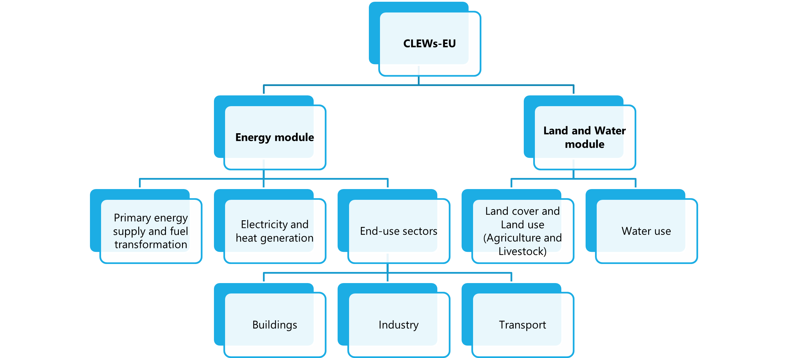

.. First landing page with a breif overview of the model.

Overview and model Structure
====================================
.. _figure1:

   **Figure 1**. Modules and sub-modules of CLEWS-EU

:ref:`Figure 1 <figure1>` shows the general structure of the CLEWS`-EU model, which consists of two main modules: the energy module, the land and water module. Each module is designed to simulate specific aspects of the European Union's resource systems, and they are interconnected to capture the interactions between energy, land, and water resources.

Individual modules and their representation in CLEWS-EU
------------------------------------------------------------

Geographical resolution of the model
------------------------------------------------------------

Aggregated regional model
~~~~~~~~~~~~~~~~~~~~~~~~~~~~~~~

Disaggregated regional model
~~~~~~~~~~~~~~~~~~~~~~~~~~~~~~~

Module specific runs
^^^^^^^^^^^^^^^^^^^^^^^^^^^^^^^
Individual modules can be run separately to test their functionality and performance. This allows for a more focused analysis of each module's behavior and its contribution to the overall model.

lumped module runs
^^^^^^^^^^^^^^^^^^^^^^^^^^^^^^^^
Modules can be run in a lumped manner, where multiple modules are combined and executed together. This approach helps in understanding the interactions between different modules and their collective impact on the model's outcomes.

